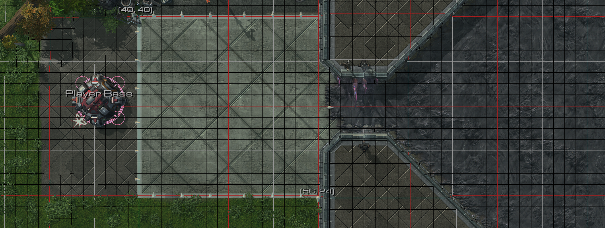
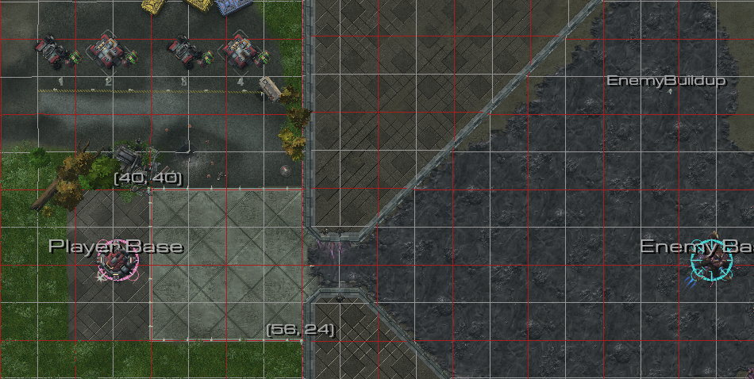
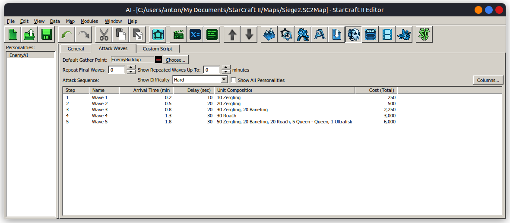
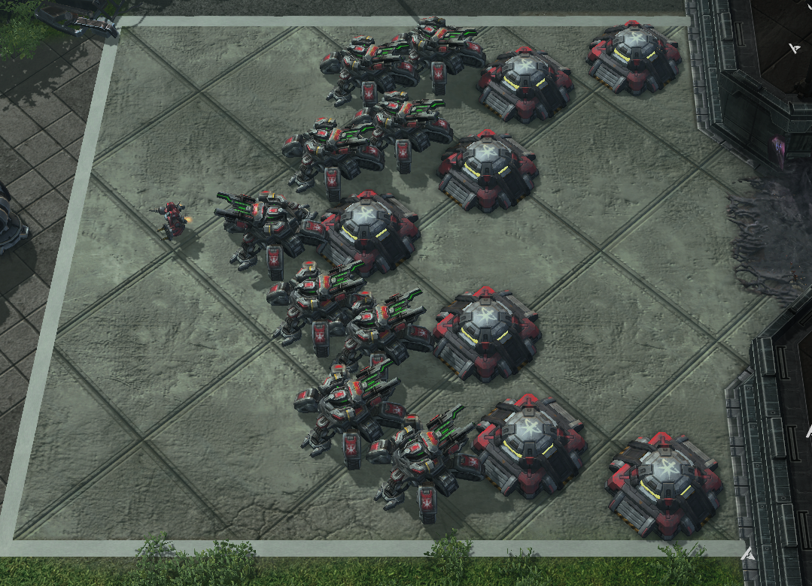

## Setting Up SC2

https://github.com/BurnySc2/python-sc2

> Enabling renders requires the full version of SC2 to be installed
> through Battle.net (using WINE on linux). python-sc2 will enable the renderer if it is
> run with the appropriate environment variables.
> 
> ```
> SC2PF=WineLinux WINE=/usr/bin/wine SC2PATH=/home/anton/.wine/drive_c/Program\ Files\ \(x86\)/StarCraft\ II/  python3 main.py
> ```

python-sc2 is fussy about where the map files are placed. For a wine install use the following
```sh
cp maps/Siege.SC2Map ~/.wine/drive_c/Program\ Files\ \(x86\)/StarCraft\ II/maps/.
```
You can probably figure out where on windows it should be placed from that.

# Scenario

The task is to evolve a 16x16 defensive position. Buildings will conform to the
grid but units wont.





The Agent is allowed an arbitrary amount of time to setup the defenses. When the Agent messages `Ready!` in chat a sequence of waves starts. The waves will attempt to reach the *command center* through the choke point in the middle of the map. Each wave is progressively more difficult.



## Evaluation

The 16x16 defensive position is evaluated by the amount of time the *command center*
survives and the resources it takes todo so.

SC2 has two types of resources: Minerals and Gas. Gas is considered more valuable.
We will have to weight them correctly.

## Headless SC2 Bug


Our map ran into an issue when being run by the headless linux client. The map 
editor is a newer version that creates incompatible levels. Luckily we found 
a fix. https://github.com/deepmind/pysc2/issues/326

```bash
smpq -x Siege.SC2Map t3Terrain.xml # Extract the offending file
# MANUALLY Replace <terrain version="115"> -> <terrain version="114">
gedit t3Terrain.xml
# Remove and replace the offending file from the archive
smpq -r Siege.SC2Map t3Terrain.xml && smpq -a Siege.SC2Map t3Terrain.xml
# Cleanup
rm t3Terrain.xml
```

### Human Solution
The scenario is solvable by a human. I found the following solution.

 - 3,500 Minerals
 - 1,300 Gas



